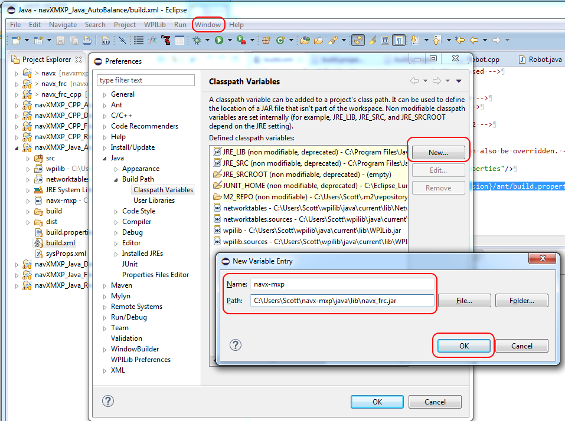
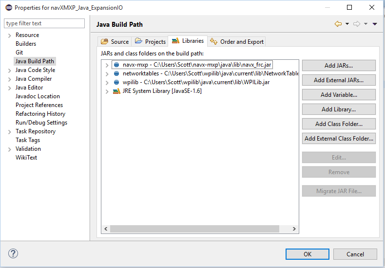
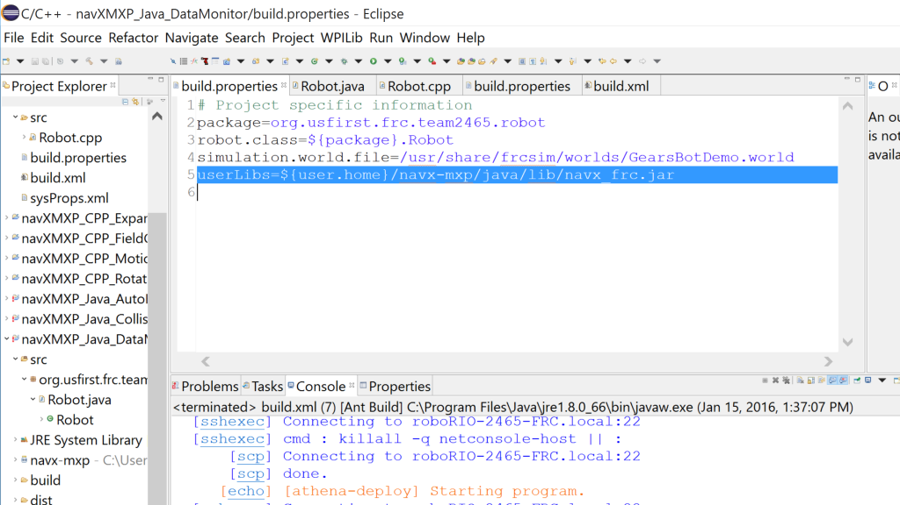

#NavX-MXP Development Instructions

(Ensure both Eclipse/Java IDE and wpilib are installed before proceeding)

###Installing NavX files

Download NavX file archive from Kauai Labs.

Unzip archive into a temp directory and run setup.exe.  This will place NavX files into the users home directory (e.g. c:\Users\Rob\navx-mxp).

###Configuring Eclipse

1) Add a Java Build Variable for the navX-MXP Java Library.  To set the build variable, from the Eclipse menu select *Window->Preferences->Java->Build Path->Classpath Variables, *then click on the "New…" button.  Then, in the “New Variable Entry” dialog, set the name to “navx-mxp” and set the Path to <HomeDirectory>\navx-mxp\java\lib\navx_frc.jar*.*  Hit OK to save this change.

2) Ensure that your project’s library paths include the navx-mxp variable, as well as WPI library path variables (networktables and wpilib).  If any are missing, you can add them by clicking on the "Add Variable…" button.

3) Modify the build.properties file *in your project*, adding a final line that sets the path to the navX-MXP library:

###Instantiating NavX in Java

Create an AHRS class object using the following method:

*AHRS myNavX;*

*myNavX = new AHRS(I2C.Port.kMXP); *

###References:

[http://www.pdocs.kauailabs.com/navx-mxp/software/roborio-libraries/java/](http://www.pdocs.kauailabs.com/navx-mxp/software/roborio-libraries/java/)

